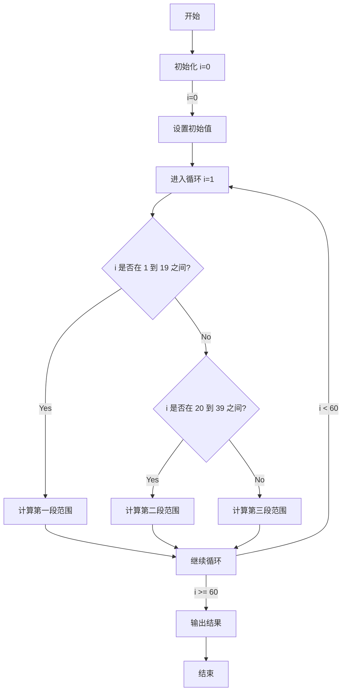

# 总体要求

实验要求完成至少31条MIPS指令的动态流水线CPU设计
支持中断。在CPU运行验证程序的过程中，由按键或拨动开关产生一个暂停的中断，再次按键或拨动开关结束中断，继续运行后续的运算
并在数码管上动态显示运算值。

# 报告框架
1. 总体结构设计
2. 总体架构部件解释
3. 仿真过程描述 ———— 操作流程
4. 仿真结果 ———— 波形图解释
5. 验算数学模型以及算法程序代码
6. 验证程序下板
7. 性能指标分析 ———— 吞吐率、加速比、效率及相关与冲突分析
8. 总结
9. 附件 ———— 代码

# 验证程序要求
### 代码功能解释

这段C++代码的主要功能是初始化四个数组 `a`、`b`、`c` 和 `d`，并根据不同的索引范围计算数组的值。具体逻辑如下：

1. **初始化**：当 `i = 0` 时，初始化 `a[0]` 为 0，`b[0]` 为 1，`c[0]` 为 `a[0]`，`d[0]` 为 `b[0]`。
2. **第一段范围 (1 ≤ i ≤ 19)**：`a[i]` 和 `b[i]` 分别基于前一个元素和当前索引 `i` 计算，`c[i]` 等于 `a[i]`，`d[i]` 等于 `b[i]`。
3. **第二段范围 (20 ≤ i ≤ 39)**：`a[i]` 和 `b[i]` 的计算方式与第一段相同，但 `c[i]` 等于 `a[i] + b[i]`，`d[i]` 等于 `a[i] * c[i]`。
4. **第三段范围 (40 ≤ i ≤ 59)**：`a[i]` 和 `b[i]` 的计算方式与前两段相同，但 `c[i]` 等于 `a[i] * b[i]`，`d[i]` 等于 `b[i] * c[i]`。

最后，输出 `a[59]`、`b[59]`、`c[59]` 和 `d[59]` 的值。

### 控制流图

