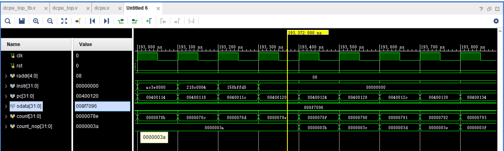

# 总体架构

本次实验设计了32条指令的动态流水线，并编写了相关的测试程序进行仿真和下板测试，分析了动态流水线CPU的相关性能，掌握了解决指令冲突的几种方法对于CPU性能的显著提升效果。对提升CPU性能的具体方法有了更加深入的了解

# 验证程序
C++运行结果(a[59], b[59], c[59], d[59]的值)：

## 依次查看四个寄存器的值
+ 寄存器6中存储了a[59]的值，十六进制的6ea，即1770

+ 寄存器7中存储了b[59]的值，十六进制的14bf，即5311

+ 寄存器8中存储了c[59]的值，十六进制的8f7096，即9400470

+ 寄存器9中存储了d[59]的值，十六进制的9fd0b7ea，即2681255914

